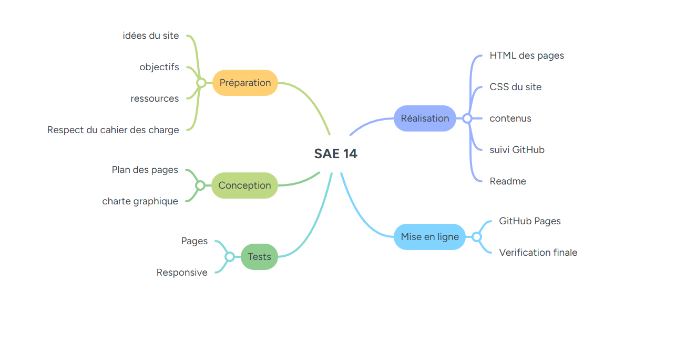
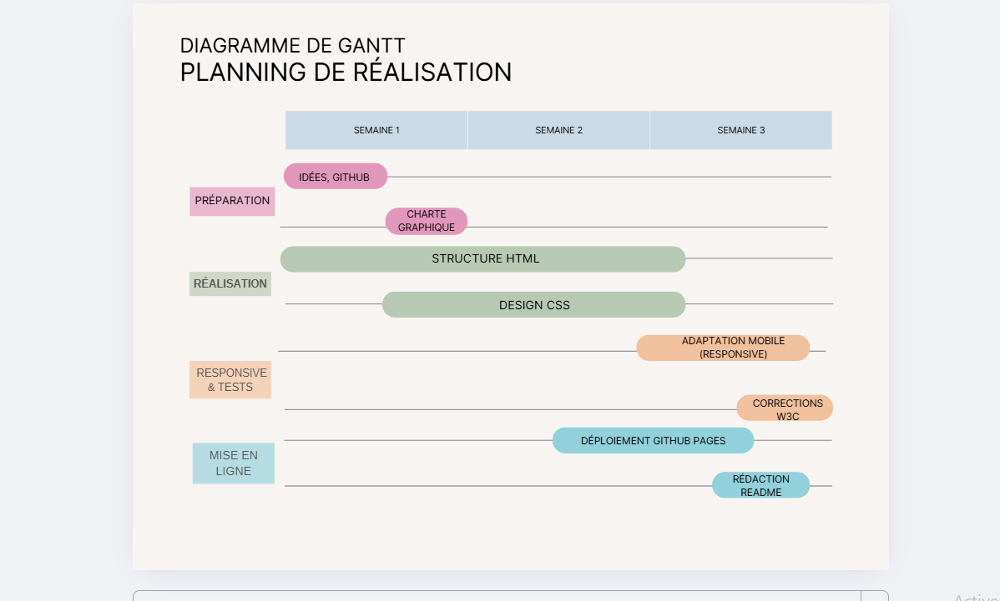
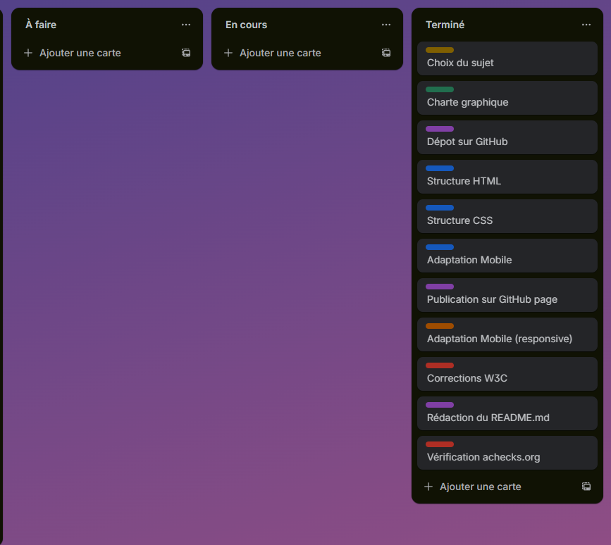
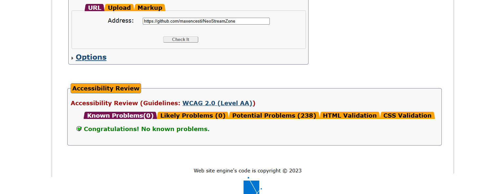

Gestion de Projet (SAÉ 14 - R1.15)

Document regroupant les livrables d'organisation pour le projet **NeoStreamZone**.

## 1. Liste des tâches (MindMap)

**(https://mm.tt/map/3865955021?t=3JBCOkRqyb)**

## 2. Planification (Gantt)
Planning de réalisation effectif sur 3 semaines.

**(https://www.canva.com/design/DAG5cLmO4Ho/nHPcLIxcfYdpyRkhVh6OCQ/edit?utm_content=DAG5cLmO4Ho&utm_campaign=designshare&utm_medium=link2&utm_source=sharebutton)**

## 3. Suivi (Trello)
Tableau Kanban pour le suivi des tâches (À faire / En cours / Terminé).

**(https://trello.com/invite/b/6915ebcba62a02aeabb9fb4f/ATTI7e0f5e87039e5a0883d6815b62808cad68FFFE98/tableau-projet-sae-maxence)**

## 5. Accessibilité (Test Achecks.org)

